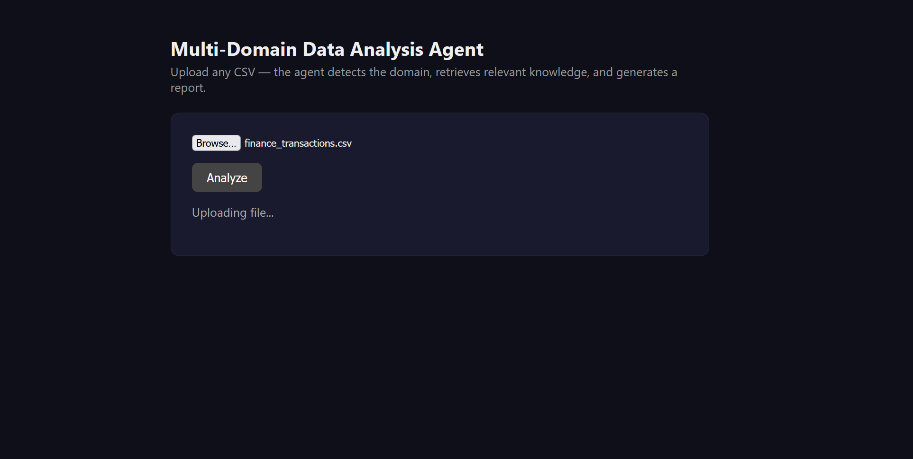
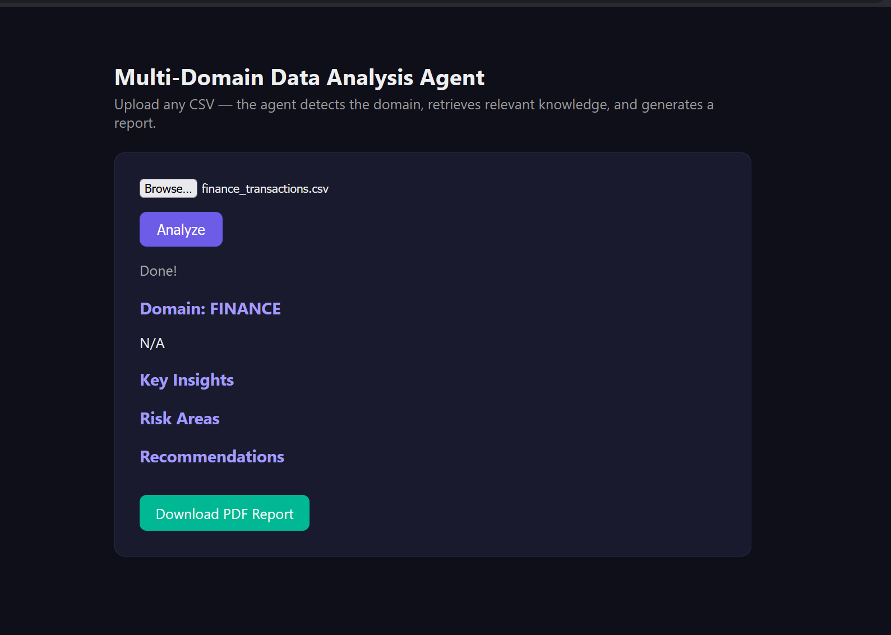
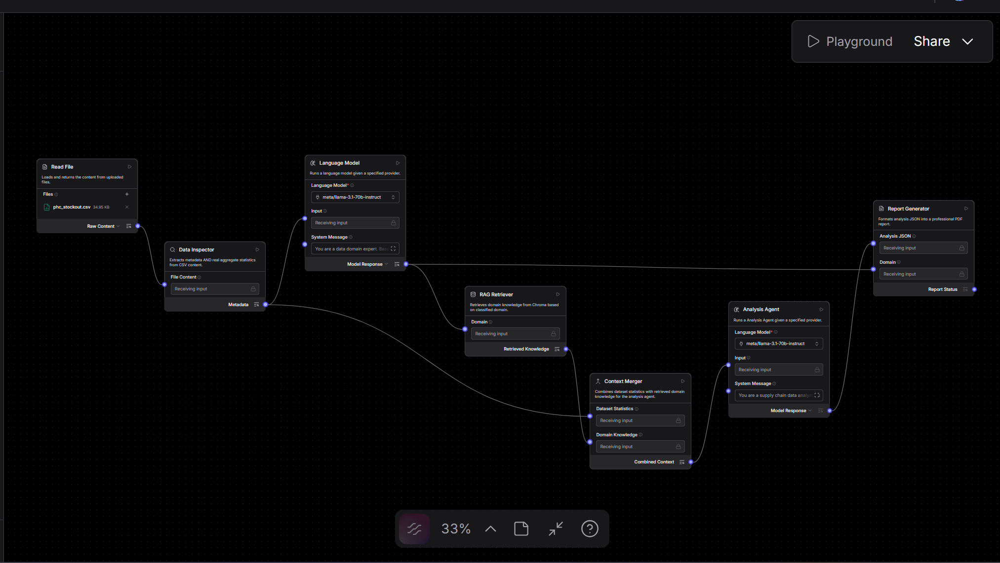

Readme · MD
# Multi-Domain Data Analysis Agent
 
An AI agent, built in [Langflow](https://www.langflow.org/), that ingests **any CSV**, automatically classifies which business domain it belongs to (healthcare, finance, supply chain, or retail), retrieves relevant domain expertise via RAG, and generates a grounded, statistics-backed analysis report — exposed through a simple web upload interface.
 
## Why this project
 
Most "AI agent" demos are a thin prompt wrapper around an LLM. This project instead combines:
 
- **Retrieval-Augmented Generation (RAG)** — a Chroma vector store holds curated domain knowledge, retrieved based on the detected domain
- **Real computed statistics** — the LLM is grounded in actual aggregate numbers (group-by rates, means, distributions) computed from the data, not left to guess
- **Multi-stage agent pipeline** — classification, retrieval, context merging, and analysis are separate, inspectable steps rather than a single black-box prompt
- **Generalization** — the same pipeline works unmodified across four different data domains
## Screenshots
 
| Upload | Results |
|---|---|
|  |  |
 
**Full pipeline in Langflow:**

 
## Architecture
 
```
CSV Upload
   |
   v
Read File  ->  Data Inspector  ->  Domain Classifier (LLM)
                (real stats)              |
                     |                    v
                     |            RAG Retriever (Chroma)
                     |                    |
                     +--------> Context Merger <---------+
                                       |
                                       v
                              Analysis Agent (LLM)
                                       |
                                       v
                              Report Generator (PDF)
```
 
| Stage | What it does |
|---|---|
| **Read File** | Accepts an uploaded CSV |
| **Data Inspector** | Custom Python component: computes shape, dtypes, null %, and real aggregate statistics (per-group rates, averages) |
| **Domain Classifier** | LLM call that reads the metadata and picks a domain (healthcare / finance / supply_chain / retail) with a confidence score |
| **RAG Retriever** | Custom component: queries the matching Chroma collection for relevant domain knowledge |
| **Context Merger** | Combines the real computed statistics with the retrieved domain knowledge into one prompt context |
| **Analysis Agent** | LLM call that produces a structured JSON analysis (summary, insights, risks, recommendations) grounded in the real numbers |
| **Report Generator** | Custom component: renders the JSON into a formatted PDF report |
 
A Flask web app (`app.py`) sits in front of Langflow's REST API, letting a user upload a CSV from the browser and get back a rendered report and downloadable PDF.
 
## Tech stack
 
- **Langflow** — visual agent/pipeline orchestration
- **Chroma** — local vector database for RAG
- **LLM** — Meta Llama 3.1 70B via NVIDIA NIM (free tier, OpenAI-compatible endpoint) — swappable for any provider Langflow supports
- **Flask** — web frontend/backend
- **Pandas** — data profiling and aggregate statistics
- **ReportLab** — PDF generation
## Setup
 
### 1. Prerequisites
- Python 3.11 or 3.12 (not a pre-release version)
- An LLM API key (this project used a free [NVIDIA NIM](https://build.nvidia.com) key with an OpenAI-compatible endpoint; any Langflow-supported provider works)
### 2. Install dependencies
```bash
python -m venv venv
venv\Scripts\activate        # Windows
# source venv/bin/activate   # macOS/Linux
 
pip install -r requirements.txt
```
 
### 3. Generate sample data (optional)
```bash
python scripts/generate_sample_data.py
```
Creates 4 synthetic CSVs in `sample_data/` — one per supported domain — for testing.
 
### 4. Populate the Chroma knowledge base
```bash
python scripts/setup_chroma.py
```
This creates a local `chroma_db/` folder with pre-written domain knowledge (5 facts each for healthcare, finance, supply chain, retail).
 
### 5. Import the flow into Langflow
```bash
langflow run
```
Open `http://localhost:7860`, create a new project, and import `langflow_flow.json`. Configure your LLM provider/API key on the Language Model nodes (the exported flow does not include credentials).
 
Update the file paths inside the **Data Inspector**, **RAG Retriever**, and **Report Generator** custom components to match your local `chroma_db/` and `reports/` paths.
 
### 6. Configure the web app
```bash
cp .env.example .env
```
Fill in `.env` with:
- `LANGFLOW_API_KEY` — from Langflow Settings -> API Keys
- `FLOW_ID` — from the flow's URL in Langflow (`http://localhost:7860/flow/<FLOW_ID>`)
- `READ_FILE_COMPONENT_ID` — find by exporting the flow as JSON and searching for `"Read File"` for the nearby `"id"` field (e.g. `File-fz3u3`)
### 7. Run the app
```bash
python app.py
```
Open `http://127.0.0.1:5000`, upload a CSV, and click Analyze. A full run (classification + RAG + analysis + PDF) typically takes 2-4 minutes depending on LLM response time.
 
## Project structure
 
```
.
├── app.py                       # Flask web app (upload UI + Langflow API bridge)
├── langflow_flow.json           # Exportable Langflow pipeline (import this)
├── requirements.txt
├── .env.example
├── scripts/
│   ├── setup_chroma.py          # Populates the RAG knowledge base
│   └── generate_sample_data.py  # Generates 4 synthetic test CSVs
└── sample_data/                 # Generated sample CSVs (after running the script)
```
 
## Known limitations
 
- The Analysis Agent occasionally makes small arithmetic slips when comparing numbers in prose (e.g. describing which of two values is "highest") even though the underlying figures it cites are correct — a known LLM reasoning limitation, not a data pipeline bug.
- Domain knowledge is currently a small, hand-written set of 5 facts per domain — easy to expand by adding more documents to the relevant Chroma collection in `scripts/setup_chroma.py`.
- The free-tier LLM used (Llama 3.1 70B via NVIDIA NIM) can be slow (30s-2min per call); swapping to a faster/paid provider would reduce total runtime significantly.
